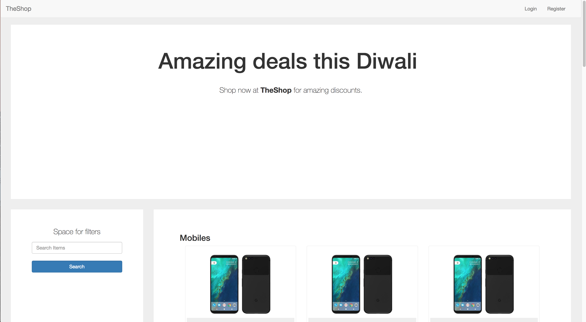
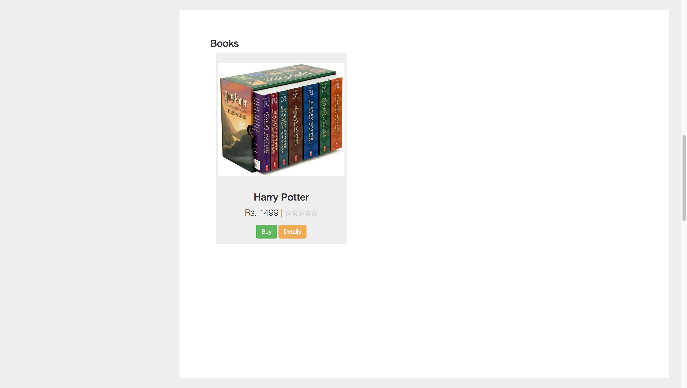
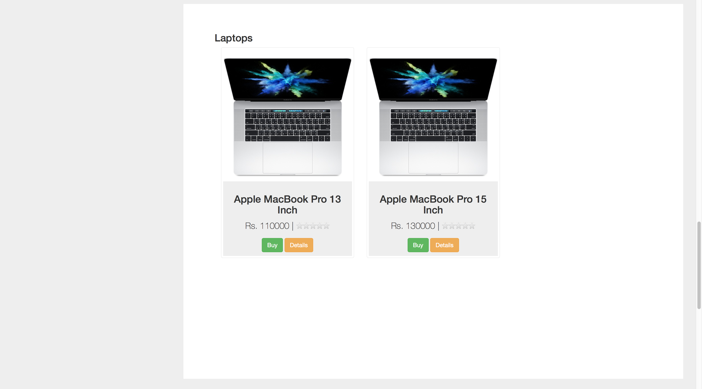
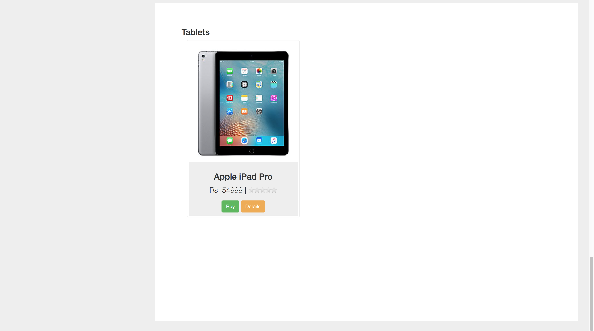
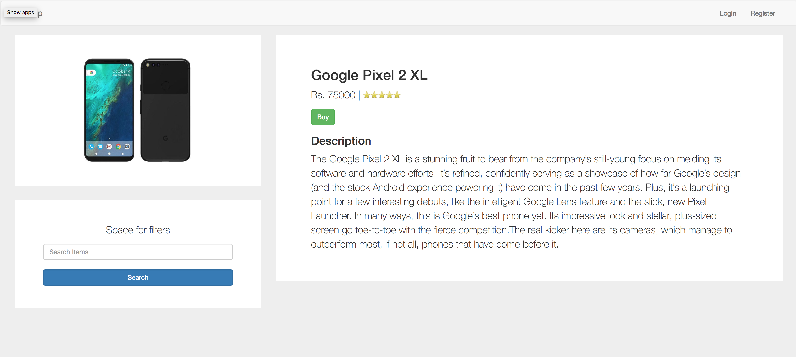
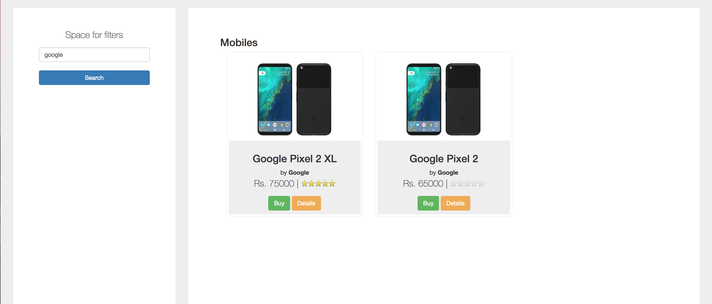
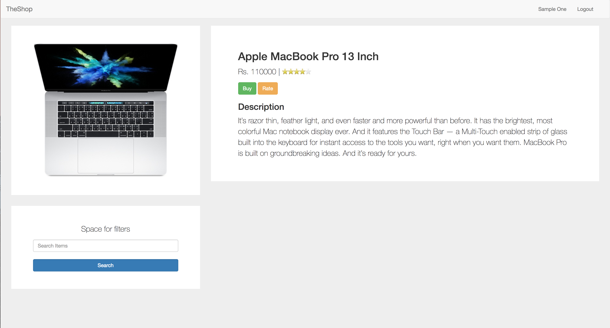
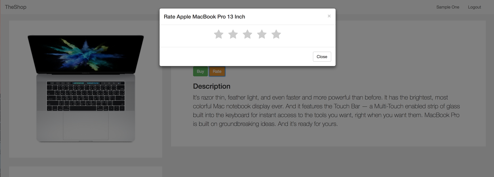
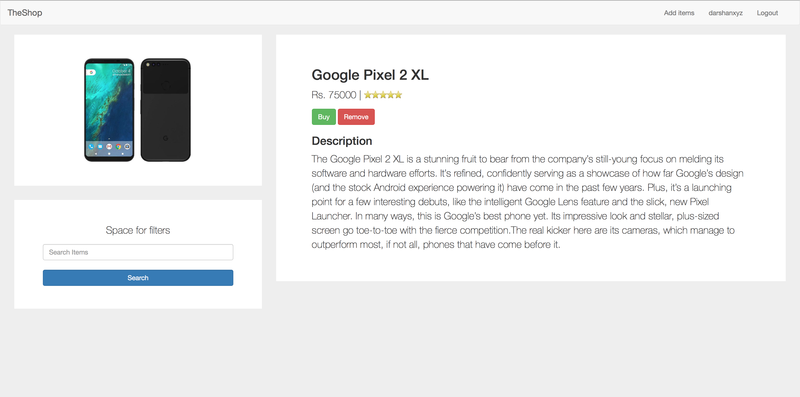
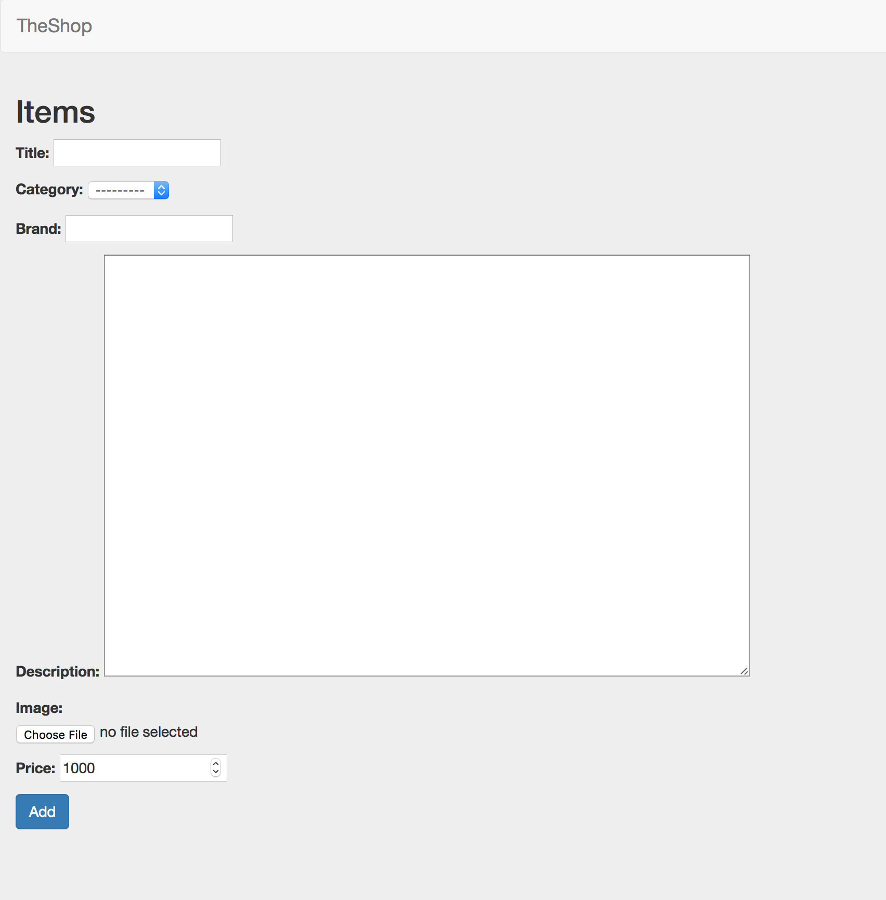

# shop
Mock eCommerce website crafted using Django.

## Features

<ul>
  <li>User registration</li>
  <li>Login</li>
  <li>Admin can <b>add</b> or <b>remove</b> items</li>
  <li>All users can see the products that are available</li>
  <li>
    Rating
    <ul>
      <li>Only users who have bought a product can rate it</li>
      <li>Rating is out of 5</li>
      <li>Average rating is displayed in case of multiple ratings</li>
    </ul>
  </li>
  <li>Django RestAPI for fetching JSON data</li>
  <li>Simple and clean UI</li>
</ul>

Further enhancements in design are to be made.

## Screenshots

### Home Page

Take a look at the home page. The items are categorized according to their category.

### Product Page

### Search

Users can search for an item by typing in the name or part of the name of an item.

### Ratings

A user can rate the product only if it is purchased by the user.

### Add or Remove products

Only the superuser has the right to add or remove products. Products can be add by clicking on the 'Add Items' link in the navigation bar. Products can be removed by clicking on the red 'Remove' button on the product's page.

